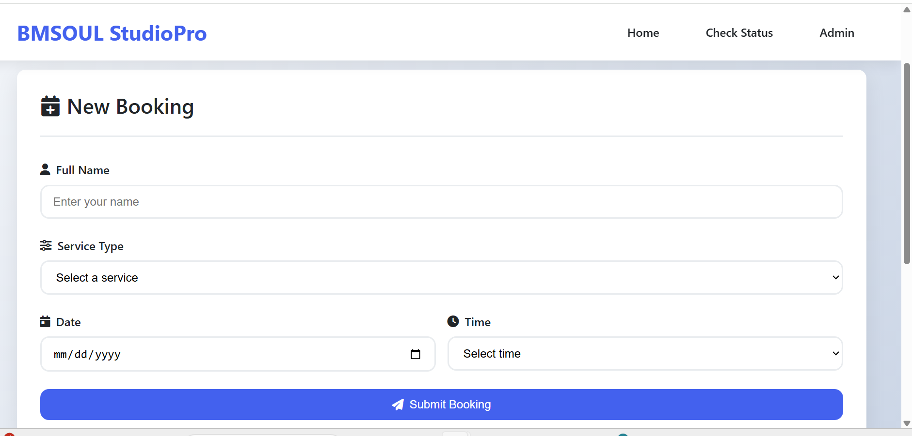
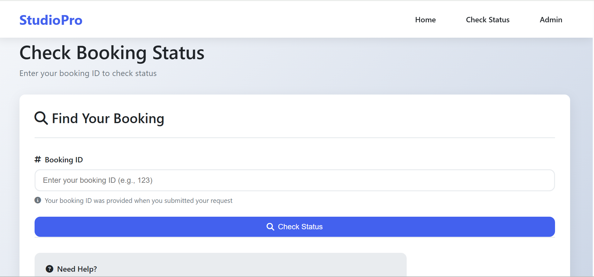
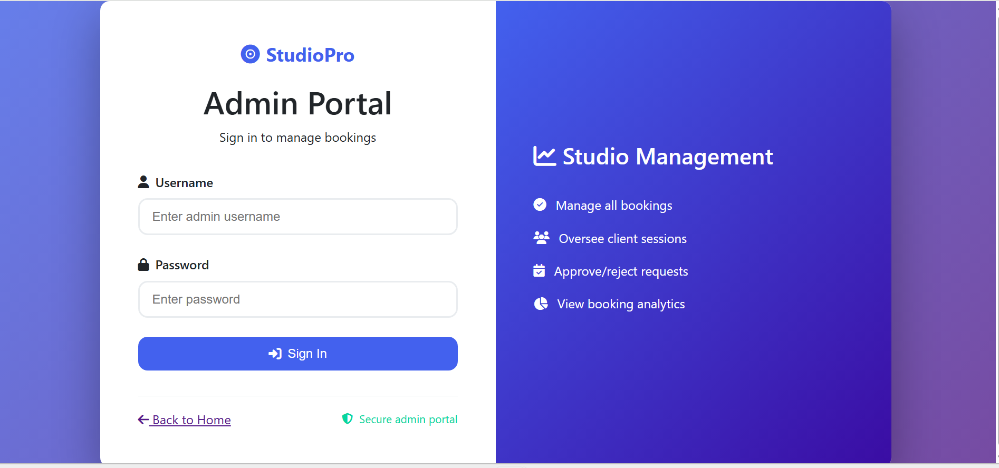

# Studio Booking System (StudioPro)

StudioPro is a Flask-based web application that allows clients to book studio sessions online and lets administrators approve or reject bookings through a secure dashboard.

## Live Demo
👉 https://studio-booking-system.onrender.com

## Screenshots

### Booking Page

### Check Booking Status

### Admin Login

## Features
- Online booking form (name, service, date, time)
- Prevents double-booking for the same time slot
- Automatic booking ID for each client
- Clients can check booking status using Booking ID
- Admin login system
- Admin can approve or reject bookings
- Real-time status updates (Pending / Approved / Rejected)
- Simple and clean user interface

## Tech Stack
- **Backend:** Python (Flask)
- **Database:** SQLite (auto-created on server)
- **Frontend:** HTML, CSS (Jinja templates)
- **Deployment:** Render
- **Version Control:** GitHub

## Project Structure
studio-booking-system/
├── app.py
├── templates/
├── static/
├── screenshots/
│ ├── booking.png
│ └── admin.png
├── requirements.txt
├── LICENSE
└── .gitignor
